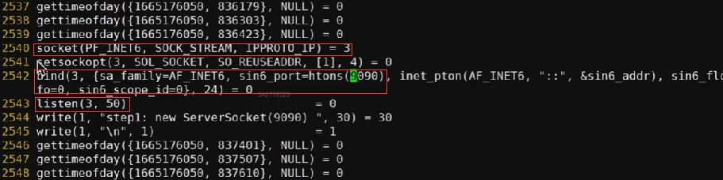
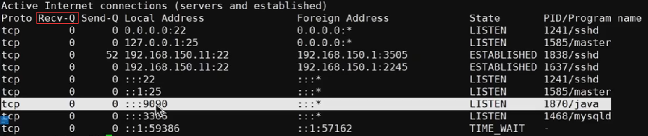 
当有一个客户端连接匹配到该listen就会将 client放入recv_Q 中 调用server.accept()将从recv_Q中获取到client
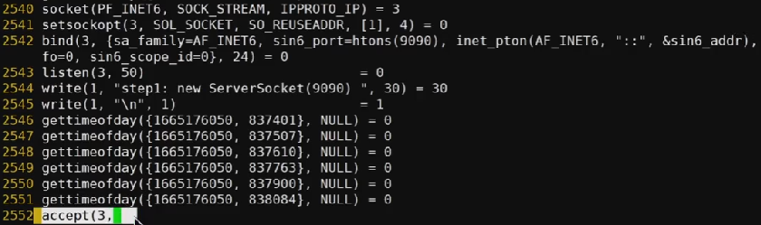
没有客户端连接进来导致阻塞recv_Q中没有值 导致server.accept()没有返回值

什么是普通的socket
 shell命令 tail -f out.1870 持续观察日志的追加信息

模拟建立连接 
nc localhost 9090
连接后
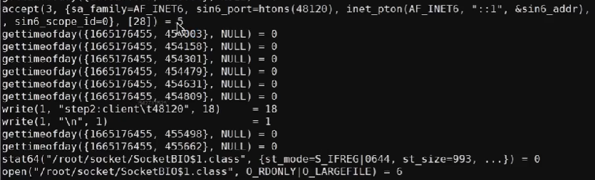
增加了一个socket
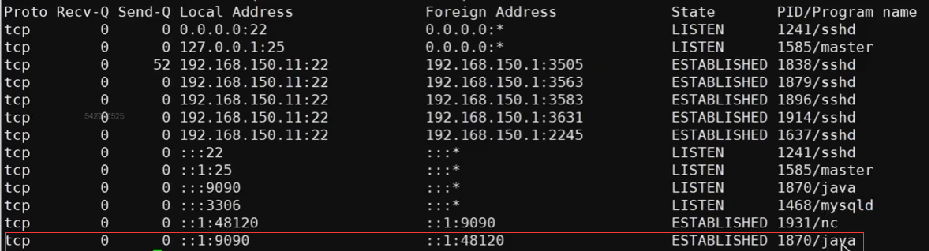
clone系统调用就是创建一个线程  1932 
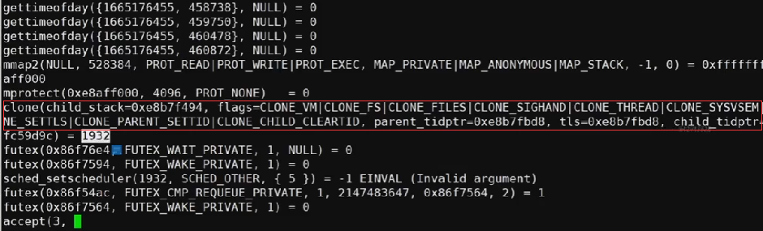
查看out.1932 由于没有发送数据 阻塞住了
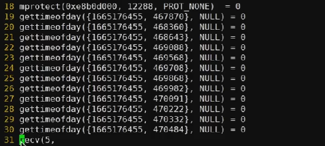 

客户端发送数据 发现接收到数据
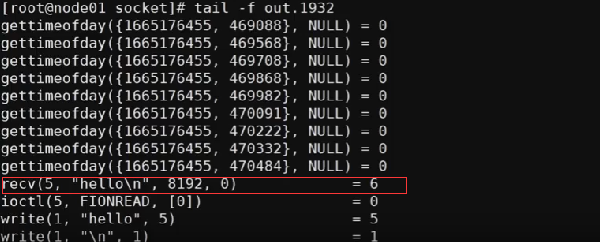

>NIO

javac SocketNIO.java
strace -ff out java SocketNIO 这里使用的是JDK 1.8进行socket追踪
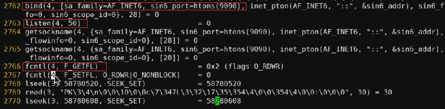
线程的不会阻塞实质是通过底层的 fcntl系统调用实现
调用accept不会阻塞，返回-1 无结果

man man 查看系统相关函数
man 2 socket 查看2类系统调用方法socket
man 2 select 
man epoll
man 2 epoll-create 创建空间
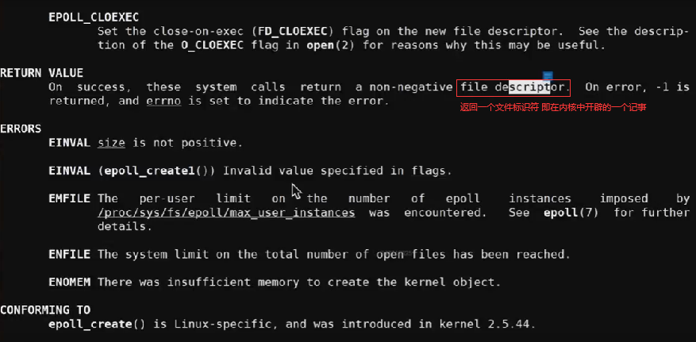
man 2 epoll-ctl 控制增删改
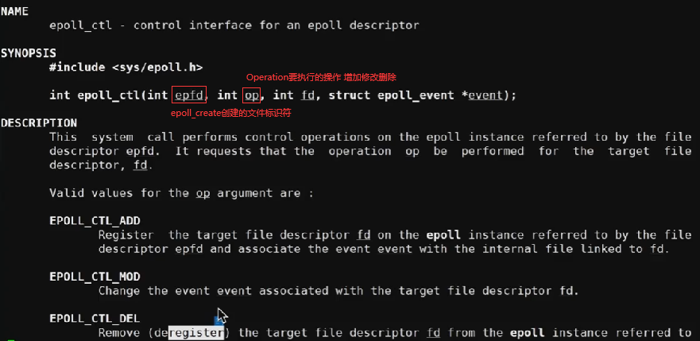
man 2 epoll-wait 等待消息处理即可
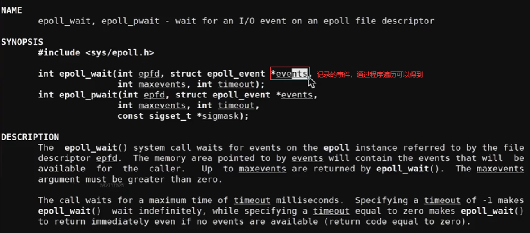

IO模型汇总

